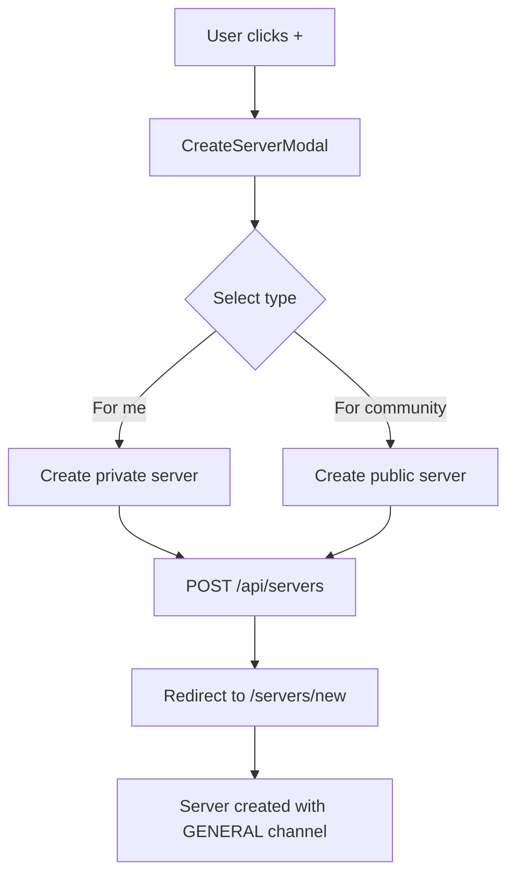
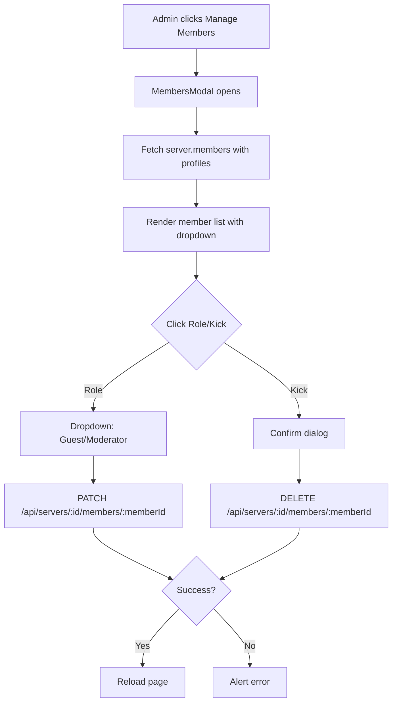
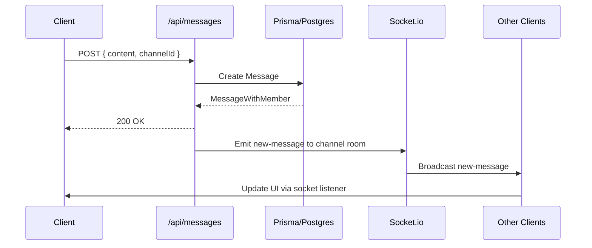
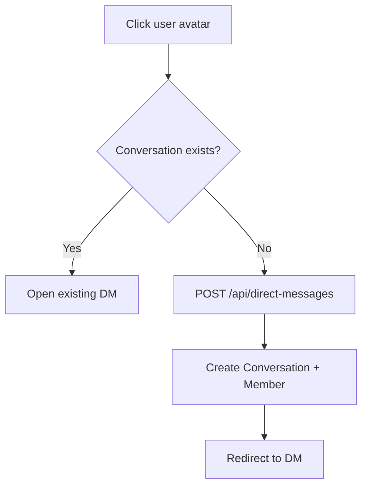
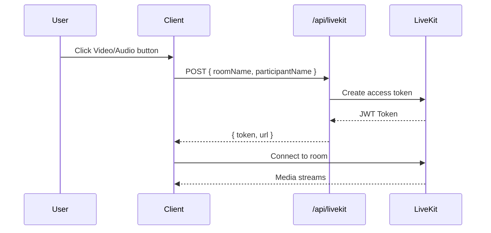

# Discord Clone - Team Chat Application

A modern, full-stack Discord-like team chat application built with **Next.js 15**, **React 19**, **TypeScript**, **Prisma ORM**, **PostgreSQL**, **Socket.io**, and **Clerk Authentication**.

---

## 🎯 Project Overview

This is a real-time team communication platform featuring servers, channels, direct messages, voice/video calls, file sharing, and member management - inspired by Discord's core functionality.

---

## 🏗️ Tech Stack

| Category | Technologies |
|----------|--------------|
| **Framework** | Next.js 15 (App Router), React 19 |
| **Language** | TypeScript (Strict Mode) |
| **Database** | PostgreSQL with Prisma ORM |
| **Authentication** | Clerk (Next.js SDK) |
| **Real-time** | Socket.io (WebSockets) |
| **State Management** | Zustand (global), TanStack Query (server state) |
| **UI Components** | shadcn/ui (Radix UI primitives), Tailwind CSS v4 |
| **File Upload** | UploadThing |
| **Video/Voice** | LiveKit |
| **Forms** | React Hook Form + Zod validation |
| **Icons** | Lucide React |
| **Theme** | next-themes (dark/light mode) |

---

## 📁 Folder Structure

```
discord/
├── app/                              # Next.js App Router
│   ├── (auth)/                       # Auth route group (Clerk)
│   ├── (invite)/                     # Invite flow route group
│   ├── api/                          # REST API Endpoints
│   │   ├── servers/
│   │   │   ├── route.ts              # GET/POST servers
│   │   │   ├── [serverId]/
│   │   │   │   ├── route.ts          # GET/PATCH/DELETE server
│   │   │   │   ├── leave/route.ts    # POST leave server
│   │   │   │   ├── invite-code/route.ts # POST regenerate invite
│   │   │   │   └── members/
│   │   │   │       └── [memberId]/route.ts # PATCH/DELETE member
│   │   ├── channels/
│   │   │   ├── route.ts              # POST create channel
│   │   │   └── [channelId]/route.ts  # PATCH/DELETE channel
│   │   ├── messages/route.ts         # POST create message
│   │   ├── direct-messages/route.ts  # POST create DM
│   │   ├── members/[memberId]/route.ts # PATCH/DELETE member (legacy)
│   │   ├── uploadthing/              # File upload endpoints
│   │   └── livekit/route.ts          # Video/voice token generation
│   ├── layout.tsx                    # Root layout with providers
│   ├── globals.css                   # Global styles + Tailwind
│   └── favicon.ico
│
├── components/                       # React Components (Feature-organized)
│   ├── ui/                           # Base UI primitives (shadcn/ui)
│   │   ├── button.tsx, dialog.tsx, dropdown-menu.tsx
│   │   ├── input.tsx, form.tsx, select.tsx
│   │   ├── avatar.tsx, user-avatar.tsx, badge.tsx
│   │   ├── scroll-area.tsx, separator.tsx, tooltip.tsx
│   │   ├── sheet.tsx, popover.tsx, command.tsx
│   │   ├── label.tsx, checkbox.tsx, radio-group.tsx
│   │   └── mobile-toggle.tsx
│   │
│   ├── server/                       # Server-related components
│   │   ├── server-sidebar.tsx        # Left sidebar (servers + channels)
│   │   ├── server-header.tsx         # Server header with actions
│   │   ├── server-member.tsx         # Member list item
│   │   ├── server-section.tsx        # Channel category section
│   │   ├── server-channel.tsx        # Individual channel
│   │   └── server-search.tsx         # Server search/command palette
│   │
│   ├── chat/                         # Chat/messaging components
│   │   ├── chat-messages.tsx         # Message list with infinite scroll
│   │   ├── chat-item.tsx             # Individual message
│   │   ├── chat-input.tsx            # Message composer
│   │   ├── chat-header.tsx           # Channel header
│   │   ├── chat-welcome.tsx          # Empty state
│   │   └── chat-video-button.tsx     # LiveKit call button
│   │
│   ├── modals/                       # Modal dialogs (all in ModalProvider)
│   │   ├── create-server-models.tsx  # Create server wizard
│   │   ├── invite-model.tsx          # Invite members modal
│   │   ├── edit-server-model.tsx     # Edit server details
│   │   ├── members-model.tsx         # **Manage members (roles/kick)**
│   │   ├── create-channel-models.tsx # Create channel (text/voice/video)
│   │   ├── edit-channel-models.tsx   # Edit channel
│   │   ├── delete-server-model.tsx   # Confirm delete server
│   │   ├── delete-channel-model.tsx  # Confirm delete channel
│   │   ├── leave-server-model.tsx    # Confirm leave server
│   │   ├── delete-message-modal.tsx  # Confirm delete message
│   │   ├── message-file-modal.tsx    # File upload preview
│   │   └── initial-models.tsx        # Onboarding modals
│   │
│   ├── providers/                    # Context Providers
│   │   ├── theme-provider.tsx        # Dark/light theme
│   │   ├── socket-provider.tsx       # Socket.io connection
│   │   ├── query-provider.tsx        # TanStack Query
│   │   └── modal-provider.tsx        # Modal registry (Zustand)
│   │
│   ├── emoji-picker.tsx              # Emoji mart picker
│   ├── file-upload.tsx               # Drag-drop file upload
│   ├── media-room.tsx                # LiveKit video/voice room
│   ├── mode-toggle.tsx               # Theme switcher
│   ├── action-tooltip.tsx            # Keyboard shortcut hints
│   └── socket-indicator.tsx          # Connection status badge
│
├── hooks/                            # Custom React Hooks
│   ├── use-modal-store.ts            # Zustand store for modals
│   ├── use-chat-socket.ts            # Socket.io event handlers
│   ├── use-chat-scroll.ts            # Auto-scroll logic
│   ├── use-chat-query.ts             # TanStack Query for messages
│   └── use-origin.ts                 # Window origin helper
│
├── lib/                              # Utilities & Configuration
│   ├── utils.ts                      # cn() className helper
│   ├── db.ts                         # Prisma client singleton
│   ├── current-profile.ts            # Get authenticated profile (App Router)
│   ├── current-profile-pages.ts      # Get authenticated profile (Pages Router)
│   ├── initial-profile.ts            # Create profile on first sign-in
│   ├── conversation.ts               # DM conversation helpers
│   ├── uploadthing.ts                # UploadThing configuration
│   └── generated/prisma/             # Prisma generated types
│
├── prisma/
│   └── schema.prisma                 # Database schema
│
├── pages/                            # Legacy Pages Router (Socket.io only)
│   └── api/socket/
│       ├── io.ts                     # Socket.io server setup
│       ├── direct-messages/[directMessageId].ts
│       └── messages/[messageId].ts
│
├── public/                           # Static assets
│   ├── file.svg, globe.svg, next.svg, vercel.svg, window.svg
│
├── types.ts                          # Shared TypeScript types
├── middleware.ts                     # Next.js middleware (Clerk auth)
├── components.json                   # shadcn/ui configuration
├── next.config.ts                    # Next.js configuration
├── tsconfig.json                     # TypeScript configuration
├── postcss.config.mjs                # PostCSS + Tailwind
├── eslint.config.mjs                 # ESLint flat config
└── package.json
```

---

## 🗄️ Database Schema (Prisma)

```mermaid
erDiagram
    Profile ||--o{ Server : owns
    Profile ||--o{ Member : has
    Profile ||--o{ Channel : creates
    Profile ||--o{ Conversation : participates
    
    Server ||--o{ Member : contains
    Server ||--o{ Channel : contains
    Server }|--|| Profile : owner
    
    Member }|--|| Profile : profile
    Member }|--|| Server : server
    Member ||--o{ Message : sends
    Member ||--o{ DirectMessage : sends
    Member ||--o{ Conversation : initiates
    Member ||--o{ Conversation : receives
    
    Channel ||--o{ Message : contains
    Channel }|--|| Server : belongs
    Channel }|--|| Profile : creator
    
    Message }|--|| Member : author
    Message }|--|| Channel : channel
    
    Conversation }|--|| Member : memberOne
    Conversation }|--|| Member : memberTwo
    Conversation ||--o{ DirectMessage : contains
    
    DirectMessage }|--|| Member : author
    DirectMessage }|--|| Conversation : conversation

    enum MemberRole {
        ADMIN
        MODERATOR
        GUEST
    }
    
    enum ChannelType {
        TEXT
        AUDIO
        VIDEO
    }
```

### Models Summary

| Model | Purpose | Key Fields |
|-------|---------|------------|
| **Profile** | User profile (linked to Clerk) | `id`, `userId`, `name`, `imageUrl`, `email` |
| **Server** | Discord "guild" | `id`, `name`, `imageUrl`, `inviteCode`, `profileId` |
| **Member** | Server membership + role | `id`, `role` (ADMIN/MODERATOR/GUEST), `profileId`, `serverId` |
| **Channel** | Text/Voice/Video channel | `id`, `name`, `type`, `profileId`, `serverId` |
| **Message** | Channel message | `id`, `content`, `fileUrl`, `memberId`, `channelId`, `deleted` |
| **Conversation** | 1-on-1 DM conversation | `id`, `memberOneId`, `memberTwoId` (unique pair) |
| **DirectMessage** | DM message | `id`, `content`, `fileUrl`, `memberId`, `conversationId`, `deleted` |

---

## 🔐 Authentication & Authorization

### Clerk Integration
- **Middleware** (`middleware.ts`): Protects all routes except `/sign-in`, `/sign-up`, `/api/*`
- **Profile Sync**: On first sign-in, `initial-profile.ts` creates a `Profile` record linked to Clerk `userId`
- **Server/Channel Access**: Verified via `current-profile.ts` checking membership

### Role-Based Access Control (MemberRole)
```
ADMIN      → Full control: manage server, channels, members (kick, role changes)
MODERATOR  → Manage messages, kick guests, change guest→moderator roles
GUEST      → Read/write messages, join voice channels
```

---

## 🔌 Real-time Architecture (Socket.io)

```
┌─────────────────────────────────────────────────────────────────┐
│                        Socket.io Server                         │
│  (pages/api/socket/io.ts - Custom Node.js server in Next.js)   │
└─────────────────────────────────────────────────────────────────┘
                              │
        ┌─────────────────────┼─────────────────────┐
        ▼                     ▼                     ▼
┌───────────────┐    ┌───────────────┐    ┌───────────────┐
│  Channel      │    │ Direct        │    │ Presence/     │
│  Messages     │    │ Messages      │    │ Typing        │
│  Events       │    │ Events        │    │ Indicators    │
└───────────────┘    └───────────────┘    └───────────────┘
```

### Socket Events

| Event | Direction | Payload | Description |
|-------|-----------|---------|-------------|
| `join-channel` | Client → Server | `{ channelId }` | Join channel room |
| `leave-channel` | Client → Server | `{ channelId }` | Leave channel room |
| `new-message` | Server → Client | `MessageWithMember` | Broadcast new message |
| `update-message` | Server → Client | `MessageWithMember` | Message edited |
| `delete-message` | Server → Client | `{ messageId, channelId }` | Message deleted |
| `new-direct-message` | Server → Client | `DirectMessageWithMember` | New DM received |
| `typing-start` | Client → Server | `{ channelId, userId }` | User started typing |
| `typing-stop` | Client → Server | `{ channelId, userId }` | User stopped typing |

---

## 🌐 REST API Endpoints

### Servers

| Method | Endpoint | Description | Auth | Body |
|--------|----------|-------------|------|------|
| `GET` | `/api/servers` | List user's servers | ✅ | - |
| `POST` | `/api/servers` | Create server | ✅ | `{ name, imageUrl }` |
| `GET` | `/api/servers/[serverId]` | Get server details | ✅ (owner) | - |
| `PATCH` | `/api/servers/[serverId]` | Update server | ✅ (owner) | `{ name, imageUrl }` |
| `DELETE` | `/api/servers/[serverId]` | Delete server | ✅ (owner) | - |
| `POST` | `/api/servers/[serverId]/leave` | Leave server | ✅ (member) | - |
| `POST` | `/api/servers/[serverId]/invite-code` | Regenerate invite | ✅ (admin) | - |

### Channels

| Method | Endpoint | Description | Auth | Body |
|--------|----------|-------------|------|------|
| `POST` | `/api/channels` | Create channel | ✅ (admin/mod) | `{ name, type, serverId }` |
| `PATCH` | `/api/channels/[channelId]` | Update channel | ✅ (admin/mod) | `{ name, type }` |
| `DELETE` | `/api/channels/[channelId]` | Delete channel | ✅ (admin/mod) | - |

### Members (Role Management & Kick)

| Method | Endpoint | Description | Auth | Body |
|--------|----------|-------------|------|------|
| `PATCH` | `/api/servers/[serverId]/members/[memberId]` | Update member role | ✅ (admin/mod) | `{ role: "GUEST" \| "MODERATOR" }` |
| `DELETE` | `/api/servers/[serverId]/members/[memberId]` | Kick member | ✅ (admin/mod) | - |

**Authorization Rules:**
- Admins can promote/demote anyone except themselves
- Moderators can only manage GUESTs (cannot touch ADMINs)
- Cannot change own role or kick yourself

### Messages & Direct Messages

| Method | Endpoint | Description | Auth | Body |
|--------|----------|-------------|------|------|
| `POST` | `/api/messages` | Send channel message | ✅ (member) | `{ content, fileUrl, channelId }` |
| `POST` | `/api/direct-messages` | Send DM / Create conversation | ✅ | `{ content, fileUrl, conversationId?, memberId? }` |

### File Upload (UploadThing)

| Method | Endpoint | Description |
|--------|----------|-------------|
| `POST` | `/api/uploadthing` | Upload files (images, videos, PDFs, etc.) |

### LiveKit (Video/Voice)

| Method | Endpoint | Description |
|--------|----------|-------------|
| `POST` | `/api/livekit` | Generate access token for room |

---

## 🎭 Key Features & Flows

### 1. Server Creation & Management


### 2. Member Management (MembersModal)


### 3. Real-time Messaging


### 4. Direct Messages


### 5. Voice/Video Calls (LiveKit)


---

## 🧩 Component Architecture

### Modal System (Zustand + Provider Pattern)

```mermaid
graph TD
    A[ModalProvider] --> B[Registers all modals at mount]
    C[useModal Store] --> D{type: ModalType}
    D -->|createServer| E[CreateServerModal]
    D -->|invite| F[InviteModal]
    D -->|editServer| G[EditServerModal]
    D -->|members| H[MembersModal]
    D -->|createChannel| I[CreateChannelModal]
    D -->|leaveServer| J[LeaveServerModal]
    D -->|deleteServer| K[DeleteServerModal]
    D -->|deleteChannel| L[DeleteChannelModal]
    D -->|editChannel| M[EditChannelModal]
    D -->|messageFile| N[MessageFileModal]
    D -->|deleteMessage| O[DeleteMessageModal]
    
    AnyComponent -->|useModal().onOpen| C
```

**Usage:**
```typescript
const { onOpen } = useModal();
onOpen("members", { server }); // Opens MembersModal with server data
```

### Server Sidebar State
- **Server List**: Fetched via TanStack Query (`useChatQuery`)
- **Active Server**: URL-driven (`/servers/[serverId]`)
- **Channels**: Nested under server, filtered by type (TEXT vs VOICE/VIDEO)

---

## 🎨 UI/UX Patterns

### shadcn/ui Components (Customized)
All base components in `components/ui/` extend Radix UI primitives with:
- Tailwind CSS v4 classes
- `cn()` utility for class merging
- Consistent `data-slot` attributes for styling
- Dark mode support via `next-themes`

### Theme System
- **Default**: Dark (Discord-like `#313338`)
- **Light**: White background
- **Persistence**: `localStorage` key `discord-theme`
- **Toggle**: `ModeToggle` component in header

### Responsive Design
- **Desktop**: Full sidebar + chat area
- **Mobile**: Slide-over sheets for servers/channels/members
- **Breakpoints**: Tailwind `md:` (768px) for sidebar collapse

---

## 🚀 Getting Started

### Prerequisites
- Node.js 20+
- PostgreSQL database
- Clerk account (auth)
- UploadThing account (files)
- LiveKit Cloud account (voice/video)

### Environment Variables
```env
# Database
DATABASE_URL="postgresql://..."

# Clerk
NEXT_PUBLIC_CLERK_PUBLISHABLE_KEY=pk_...
CLERK_SECRET_KEY=sk_...
NEXT_PUBLIC_CLERK_SIGN_IN_URL=/sign-in
NEXT_PUBLIC_CLERK_SIGN_UP_URL=/sign-up

# UploadThing
UPLOADTHING_SECRET=sk_...
UPLOADTHING_APP_ID=...

# LiveKit
LIVEKIT_API_KEY=...
LIVEKIT_API_SECRET=...
LIVEKIT_URL=wss://...

# Socket.io (for Pages API)
NEXT_PUBLIC_SOCKET_URL=http://localhost:3000
```

### Installation
```bash
cd discord
npm install

# Generate Prisma client
npm run prisma:generate

# Run migrations
npm run prisma:migrate

# Start development server
npm run dev
```

### Database Commands
```bash
npm run prisma:generate   # Generate Prisma Client
npm run prisma:migrate    # Run migrations (dev)
npm run prisma:studio     # Open Prisma Studio
```

---

## 📝 Code Conventions

### File Naming
- Components: `PascalCase.tsx` (e.g., `ServerSidebar.tsx`)
- Hooks: `use-kebab-case.ts` (e.g., `use-chat-socket.ts`)
- API Routes: `route.ts` in `[resource]/[id]/` folders
- Types: `types.ts` (root) or co-located

### Import Aliases
```typescript
@/components/*     → components/
@/hooks/*          → hooks/
@/lib/*            → lib/
@/types            → types.ts
```

### State Management
| Scope | Tool | Example |
|-------|------|---------|
| Global UI (modals) | Zustand | `useModalStore` |
| Server State | TanStack Query | `useChatQuery` |
| Form State | React Hook Form | `useForm` |
| Local UI | useState/useReducer | Component state |

---

## 🧪 Testing & Quality

```bash
npm run lint          # ESLint (flat config)
npm run build         # Next.js production build
npm run typecheck     # tsc --noEmit (if configured)
```

---

## 📄 License

MIT License - Feel free to use for learning or as a starter template.

---

## 🙏 Acknowledgments

- [shadcn/ui](https://ui.shadcn.com/) for beautiful accessible components
- [Clerk](https://clerk.com/) for authentication
- [UploadThing](https://uploadthing.com/) for file uploads
- [LiveKit](https://livekit.io/) for WebRTC infrastructure
- [Prisma](https://prisma.io/) for type-safe database access
- [Socket.io](https://socket.io/) for real-time communication

# Live Deployed URL
https://discord-clone-production-58a5.up.railway.app
